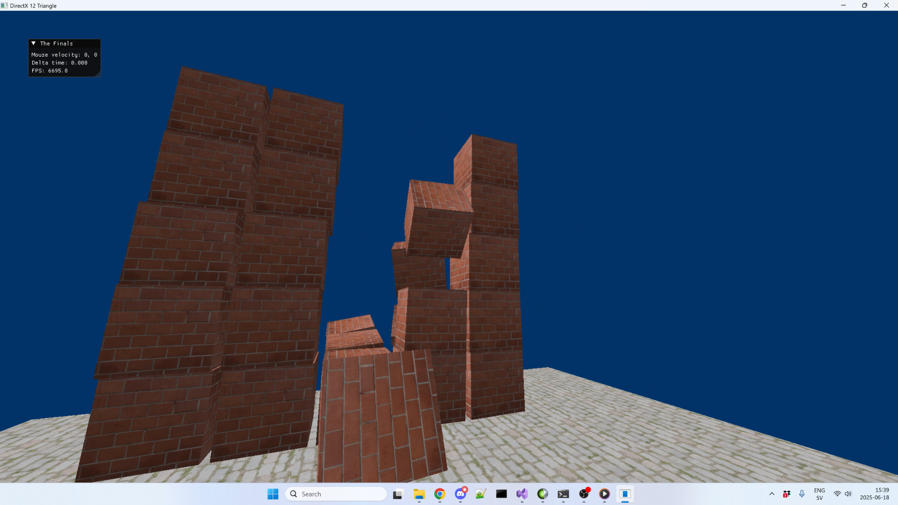

# Setup
1. Double click on `copy_assets_libraries_debug.bat` or/and `copy_assets_libraries_release.bat`. This will copy the assets from the asset folder to the configuration directory.
2. Open up the `TheFinals.sln`.
3. In Visual Studio `Solution Explorer` window right click on the project and click `Properties -> Debugging -> Working Directory` and set it to `$(OutDir)`. Make sure that `All Configurations` and `All Platforms`(now just x64), are selected when you change the Working Directory.

# Running
 - Walk with WASD keys.
 - Hold the right mouse button to look around.
 - Shoot with the left mouse button.
 - Press Space key to jump.

 
